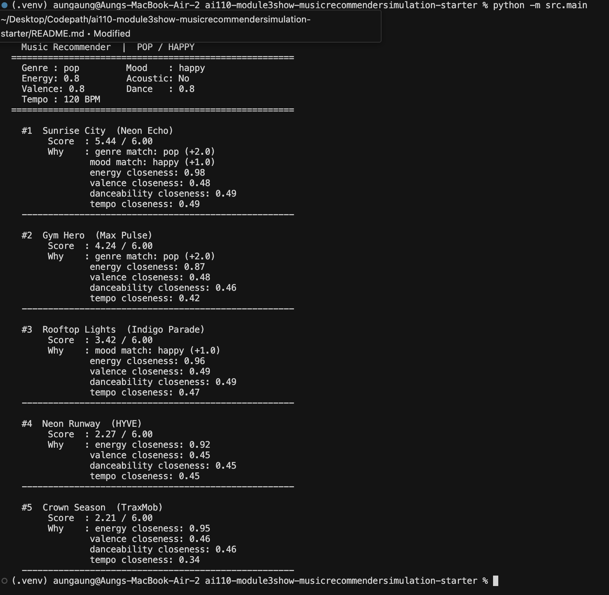
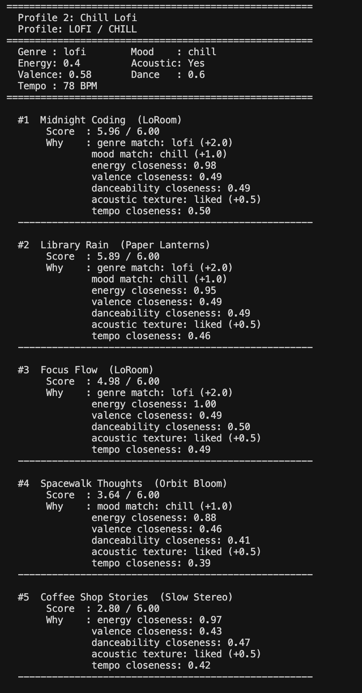
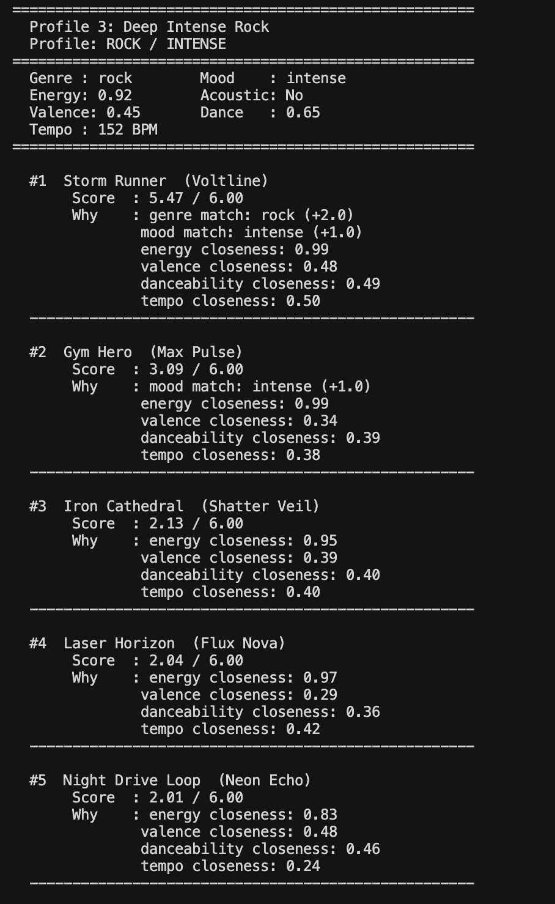
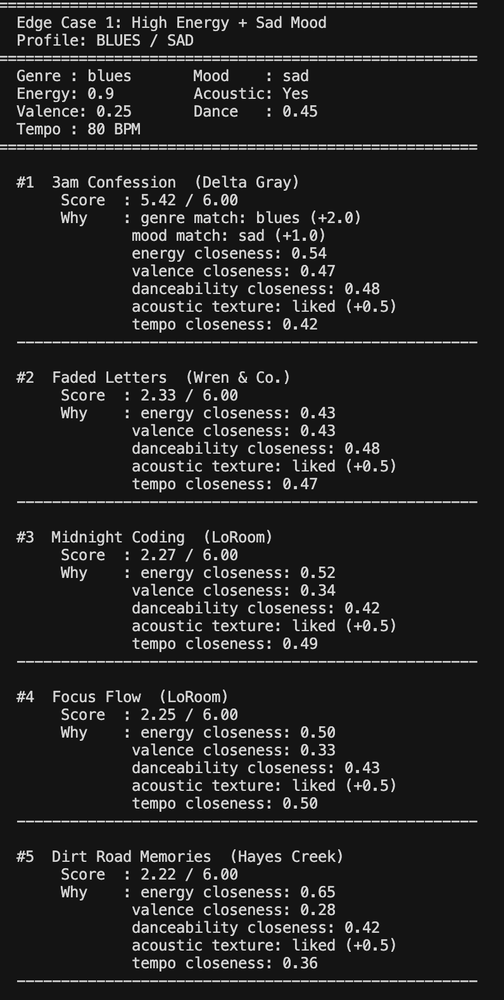
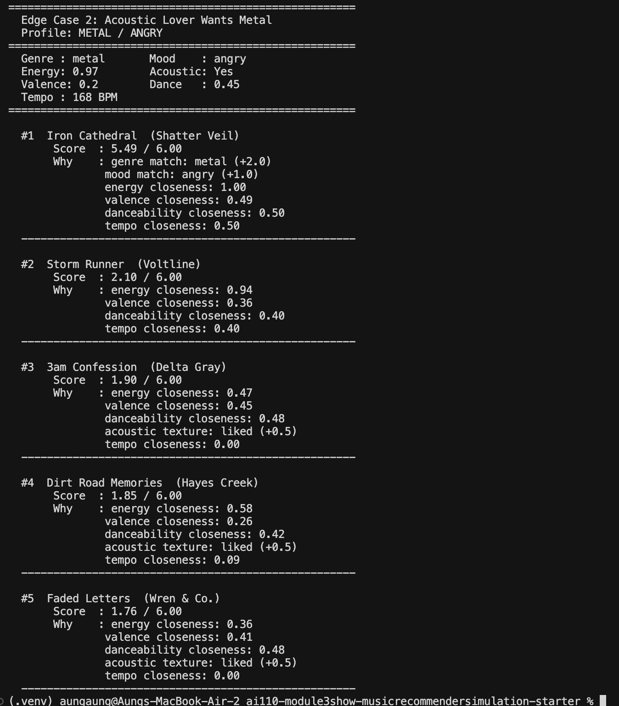

# 🎵 Music Recommender Simulation

## Project Summary

In this project you will build and explain a small music recommender system.

Your goal is to:

- Represent songs and a user "taste profile" as data
- Design a scoring rule that turns that data into recommendations
- Evaluate what your system gets right and wrong
- Reflect on how this mirrors real world AI recommenders

Replace this paragraph with your own summary of what your version does.

---

## How The System Works

This recommender is deliberately small and transparent. There are no learned weights — every scoring decision is a hand-written rule, so results are fully explainable.

### Data Flow

```mermaid
flowchart TD
    A[“data/songs.csv\n(20 songs)”] -->|”load_songs(csv_path)”| B[“List of Song Dicts”]
    B --> C[“recommend_songs(user_prefs, songs, k=5)”]
    C --> D{“For each song\nin catalog”}
    D --> E[“score_song(user_prefs, song)\nreturns (score, reasons)”]
    E --> F[“Apply Algorithm Recipe\n(see table below)”]
    F --> D
    D -->|”All 20 songs scored”| G[“Sort descending by total score”]
    G --> H[“Slice top k = 5”]
    H --> I[“Output: (song_dict, score, explanation_string)”]
```

### Song Features

| Field | Type | Description |
|---|---|---|
| `id`, `title`, `artist` | identity | display only, not scored |
| `genre` | string | categorical style label |
| `mood` | string | emotional tone label |
| `energy` | 0.0–1.0 | intensity (calm → maximum) |
| `valence` | 0.0–1.0 | positivity (dark → bright) |
| `danceability` | 0.0–1.0 | rhythmic/groovy feel |
| `acousticness` | 0.0–1.0 | acoustic vs. electronic texture |
| `tempo_bpm` | float | beats per minute |

### User Profile Keys

| Key | Type | Description |
|---|---|---|
| `genre` | string | preferred genre (exact-match target) |
| `mood` | string | preferred mood (exact-match target) |
| `target_energy` | 0.0–1.0 | preferred energy level |
| `likes_acoustic` | bool | rewards acoustic texture when True |
| `target_valence` | 0.0–1.0 | preferred emotional brightness |
| `target_danceability` | 0.0–1.0 | preferred groove level |
| `target_tempo_bpm` | float | preferred beats per minute |

### Algorithm Recipe

| Signal | Max Points | Formula |
|---|---|---|
| Genre match | **+2.0** | `+2.0` if `song.genre == user.genre`, else `0` |
| Mood match | **+1.0** | `+1.0` if `song.mood == user.mood`, else `0` |
| Energy closeness | **+1.0** | `1.0 - abs(song.energy - user.target_energy)` |
| Valence closeness | **+0.5** | `0.5 * (1 - abs(song.valence - user.target_valence))` |
| Danceability closeness | **+0.5** | `0.5 * (1 - abs(song.danceability - user.target_danceability))` |
| Acousticness fit | **±0.5** | `+0.5` if `likes_acoustic` and `acousticness ≥ 0.6`, `-0.5` if `not likes_acoustic` and `acousticness ≥ 0.6` |
| Tempo closeness | **+0.5** | `0.5 * max(0, 1 - abs(song.tempo_bpm - user.target_tempo_bpm) / 80)` |

**Maximum possible score: 6.0**

Genre carries the most weight (2.0 / 6.0 = 33 %) to keep results on-style. Mood comes next (17 %). Numeric features together account for the remaining 50 %, so a song in the wrong genre can still rank well if it matches everything else closely.

### Ranking Rule

1. Score every song in the catalog using the recipe above.
2. Sort by total score descending.
3. Return the top `k` results (default `k = 5`), each with its score and a comma-joined explanation string built from the matching reasons.

### Expected Biases

- **Genre dominance:** A perfect genre match (+2.0) can outrank a better overall numeric fit that’s in the wrong genre. A blues fan asking for “pop” will never see their best matches bubble up.
- **Exact-match brittleness:** `”indie pop”` and `”pop”` are different strings, so an indie pop song scores 0 on genre even though it’s close. Real systems use embeddings to avoid this.
- **Acousticness cliff:** The ±0.5 rule kicks in only at `acousticness ≥ 0.6`. Songs at 0.59 are treated the same as fully electronic ones.
- **Cold-start:** The profile is hand-coded. There is no implicit feedback (plays, skips, saves), so the system cannot learn or adapt.


## Getting Started

### Setup

1. Create a virtual environment (optional but recommended):

   ```bash
   python -m venv .venv
   source .venv/bin/activate      # Mac or Linux
   .venv\Scripts\activate         # Windows

2. Install dependencies

```bash
pip install -r requirements.txt
```

3. Run the app:

```bash
python -m src.main
```

### Running Tests

Run the starter tests with:

```bash
pytest
```

You can add more tests in `tests/test_recommender.py`,
---

## Sample Output

### Profile 1 — High-Energy Pop (default)



### Profile 2 — Chill Lofi



### Profile 3 — Deep Intense Rock



### Edge Case 1 — High Energy + Sad Mood

Conflicting signals: `energy: 0.9` pulls toward metal/electronic, but `mood: sad` only
exists in blues (low energy). The genre+mood match still wins — `3am Confession` tops
the list despite a poor energy fit (score 0.54), showing how exact-match bonuses can
override numeric closeness.



### Edge Case 2 — Acoustic Lover Wants Metal

Contradictory: `likes_acoustic: True` but `genre: metal`. No metal song has
`acousticness ≥ 0.6`, so the acoustic bonus never fires — Iron Cathedral wins on
genre+mood+energy alone. Scores #3–5 drift to acoustic songs (blues, folk, country)
that have nothing to do with metal, revealing the acousticness bias.



---

## Experiments You Tried

### Experiment 1 — Weight Shift: genre 2.0→1.0, energy 1.0→2.0

**Change:** Halved the genre match bonus and doubled the energy closeness multiplier.

**Pop/Happy profile — before vs. after:**

| Rank | Before (genre=2.0) | Score | After (genre=1.0, energy×2) | Score |
|---|---|---|---|---|
| #1 | Sunrise City (pop/happy) | 5.44 | Sunrise City (pop/happy) | 5.42 |
| #2 | Gym Hero (pop/intense) | 4.24 | Rooftop Lights (indie pop/happy) | 4.38 |
| #3 | Rooftop Lights (indie pop/happy) | 3.42 | Gym Hero (pop/intense) | 4.11 |
| #4 | Neon Runway (k-pop) | 2.27 | Neon Runway (k-pop) | 3.19 |
| #5 | Crown Season (hip-hop) | 2.21 | Crown Season (hip-hop) | 3.16 |

**Finding:** Sunrise City stayed #1 because it matches on every signal. The more
interesting shift was #2 and #3 swapping: Rooftop Lights (indie pop, energy=0.76)
overtook Gym Hero (pop, energy=0.93) because its energy is closer to the 0.8 target.
With a smaller genre bonus, being in the "right" genre matters less and feeling the
right energy level matters more. The bottom two songs (Neon Runway, Crown Season)
jumped from ~2.2 to ~3.2, showing how much the halved genre bonus opened the door for
non-pop songs.

**Conclusion:** The original weights (genre=2.0) keep results style-loyal. The
experimental weights (energy×2) make results more vibe-driven. Neither is objectively
correct — it depends on whether the user cares more about genre consistency or
energy feel.

---

### Experiment 2 — Diverse Profiles

Tested five profiles covering: High-Energy Pop, Chill Lofi, Deep Intense Rock,
High-Energy + Sad (adversarial), Acoustic Lover + Metal (adversarial).

Key observation: The lofi profile scored the highest (5.96/6.00) because the catalog
has three lofi songs with tightly matching numeric features. The rock profile dropped
sharply from #1 to #2 (5.47 → 3.09) because there is only one rock song. This
reveals a catalog-size bias — genres with more songs are served much better.

---

## Limitations and Risks

Summarize some limitations of your recommender.

Examples:

- It only works on a tiny catalog
- It does not understand lyrics or language
- It might over favor one genre or mood

You will go deeper on this in your model card.

---

## Reflection

Read and complete `model_card.md`:

[**Model Card**](model_card.md)

Write 1 to 2 paragraphs here about what you learned:

- about how recommenders turn data into predictions
- about where bias or unfairness could show up in systems like this


---

## 7. `model_card_template.md`

Combines reflection and model card framing from the Module 3 guidance. :contentReference[oaicite:2]{index=2}  

```markdown
# 🎧 Model Card - Music Recommender Simulation

## 1. Model Name

Give your recommender a name, for example:

> VibeFinder 1.0

---

## 2. Intended Use

- What is this system trying to do
- Who is it for

Example:

> This model suggests 3 to 5 songs from a small catalog based on a user's preferred genre, mood, and energy level. It is for classroom exploration only, not for real users.

---

## 3. How It Works (Short Explanation)

Describe your scoring logic in plain language.

- What features of each song does it consider
- What information about the user does it use
- How does it turn those into a number

Try to avoid code in this section, treat it like an explanation to a non programmer.

---

## 4. Data

Describe your dataset.

- How many songs are in `data/songs.csv`
- Did you add or remove any songs
- What kinds of genres or moods are represented
- Whose taste does this data mostly reflect

---

## 5. Strengths

Where does your recommender work well

You can think about:
- Situations where the top results "felt right"
- Particular user profiles it served well
- Simplicity or transparency benefits

---

## 6. Limitations and Bias

Where does your recommender struggle

Some prompts:
- Does it ignore some genres or moods
- Does it treat all users as if they have the same taste shape
- Is it biased toward high energy or one genre by default
- How could this be unfair if used in a real product

---

## 7. Evaluation

How did you check your system

Examples:
- You tried multiple user profiles and wrote down whether the results matched your expectations
- You compared your simulation to what a real app like Spotify or YouTube tends to recommend
- You wrote tests for your scoring logic

You do not need a numeric metric, but if you used one, explain what it measures.

---

## 8. Future Work

If you had more time, how would you improve this recommender

Examples:

- Add support for multiple users and "group vibe" recommendations
- Balance diversity of songs instead of always picking the closest match
- Use more features, like tempo ranges or lyric themes

---

## 9. Personal Reflection

A few sentences about what you learned:

- What surprised you about how your system behaved
- How did building this change how you think about real music recommenders
- Where do you think human judgment still matters, even if the model seems "smart"

